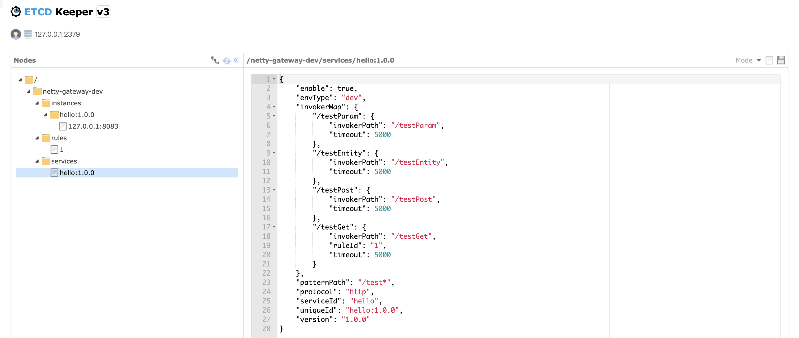
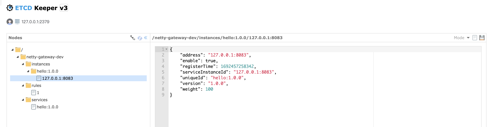
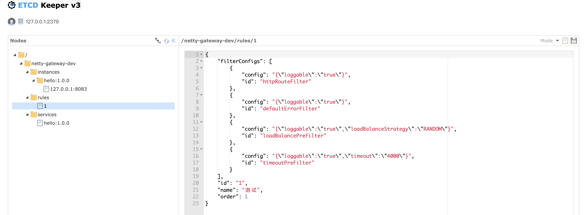
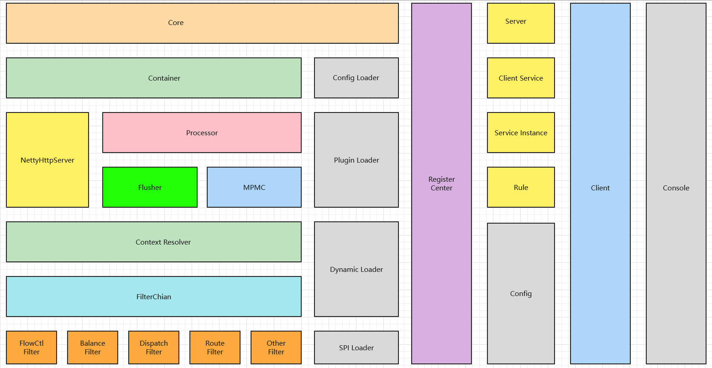
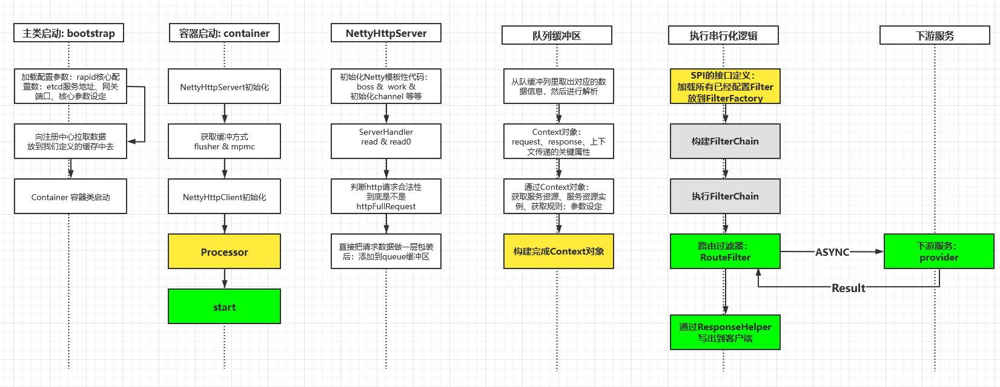
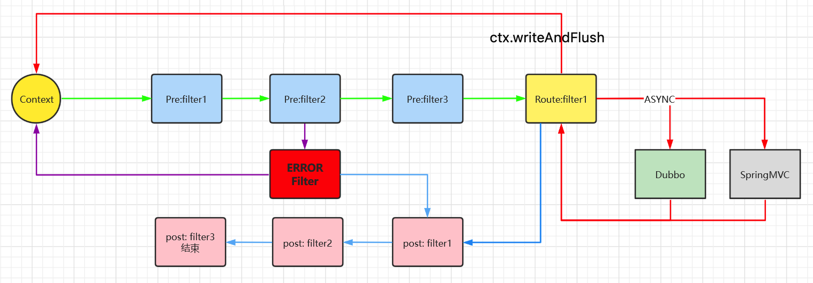
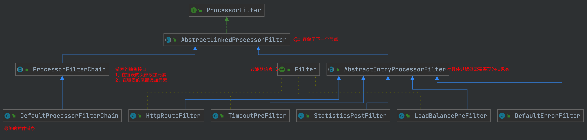

# ⬆️ 测试&快速体验

## 1、查看数据

### 服务

```bash
curl --location --request GET 'http://127.0.0.1:9005/serviceDefinition/getList?prefixPath=netty-gateway-dev' \
--header 'Cookie: uid=1'
```




### 实例

```bash
curl --location --request GET 'http://127.0.0.1:9005/serviceInstance/getList?prefixPath=netty-gateway-dev&uniqueId=hello:1.0.0' \
--header 'Cookie: uid=1'
```




### 规则

```bash
curl --location --request GET 'http://127.0.0.1:9005/rule/getList?prefixPath=netty-gateway-dev' \
--header 'Cookie: uid=1'
```




### 调用方法列表

```bash
curl --location --request GET 'http://127.0.0.1:9005/serviceInvoker/getListByUniqueId?namespace=netty-gateway-dev&uniqueId=hello:1.0.0' \
--header 'Cookie: uid=1'
```


## 2、添加规则

```bash
curl --location --request POST 'http://127.0.0.1:9005/rule/add' \
--header 'uniqueId: hello:1.0.0' \
--header 'Cookie: uid=1; uid=1' \
--header 'Content-Type: application/json' \
--data-raw '{
    "filterConfigs": [
        {
            "config": "{\"loggable\":\"true\"}",
            "id": "defaultErrorFilter"
        },
        {
            "config": "{\"loggable\":\"true\",\"loadBalanceStrategy\":\"RANDOM\"}",
            "id": "loadBalancePreFilter"
        },
        {
            "config": "{\"loggable\":\"true\"}",
            "id": "httpRouteFilter"
        },
        {
            "config": "{\"loggable\":\"true\",\"timeout\":\"4000\"}",
            "id": "timeoutPreFilter"
        }
    ],
    "id": "1",
    "name": "测试",
    "order": 1,
    "protocol": "http",
    "namespace": "netty-gateway-dev"
}'
```


## 3、服务绑定规则

```bash
curl --location --request POST 'http://127.0.0.1:9005/serviceInvoker/bindingRuleId?serviceId=hello&invokerPath=/testMvc/testGet&ruleId=1&namespace=netty-gateway-dev' \
--header 'uniqueId: hello:1.0.0' \
--header 'Cookie: uid=1; uid=1; uid=1' \
--header 'Content-Type: application/json' \
--data-raw ''
```


## 4、测试下游服务

```bash
curl --location --request GET 'http://127.0.0.1:8083/testMvc/testGet'
```


## 5、测试网关

```bash
curl --location --request GET 'http://127.0.0.1:8888/testMvc/testGet'
```


# ❓ 明确网关功能&各种利弊取舍

## 1、需要支持哪些功能

```bash
1、URL是否支持REST
2、网关是否是只支持POST&JSON格式的请求
3、网关是否支持传输文件
4、网关是否支持其他请求协议，tcp、udp、grpc
5、后端服务都有哪些，JAVA、Go
6、后端服务都是些什么协议 http、grpc、double
```

## 2、要支持这些功能应该怎么设计网关

```bash
```


# 🧭 架构设计&包结构划分

## 1、架构设计




## 2、整体包结构说明

```text
~/code/gateway/netty-gateway (master*) » find . -maxdepth 3 -type d -print | sed -e 's;[^/]*/;|____;g;s;____|; |;g'
.
|____netty-gateway-test-mvc
|____netty-gateway-test-dubbo
|____doc
|____netty-gateway						  			// parent包
| |____netty-gateway-common						// 公共包
| |____netty-gateway-core							// 网关核心服务
| |____netty-gateway-client						// 客户端依赖包，用于注册http、dubbo服务到注册中心
| |____netty-gateway-discovery				// 注册中心父包
| | |____netty-gateway-discovery-api	// 注册中心接口定义
| | |____netty-gateway-discovery-etcd	// 注册中心etcd实现
| |____netty-gateway-console					// 控制台
```

## 3、⚠️注意

> netty、dubbo、zookeeper三者的版本需要保持一致：和系统的尽量统一，不然会有不可预期的问题和错误；
> netty版本：4.1.51.Final
> dubbo版本：2.7.4.1
> zookeeper版本：3.4.11


# 🚗 网关整体流程




# 📖 网关上下文设计


## 1、标识请求状态&声明周期

```java
//	一个请求正在执行过程中
int RUNNING = -1;

// 	写回响应标记, 标记当前Context/请求需要写回，fireNext检测到该状态了，就执行ctx.writeAndFlush(response)，将状态流转为COMPLETED
int WRITTEN = 0;

//	当写回成功后, 设置该标记：ctx.writeAndFlush(response);
int COMPLETED = 1;

//	表示整个网关请求完毕, 彻底结束
//	1. 正常结束（有响应结果，程序正常执行完成）pre -> route - post 
//  2. 异常结束（显示抛出异常）
int TERMINATED = 2;
```


## 2、记录请求时间


## 3、记录上下文属性


# 🤝 用尽缓存

## 1、etcd数据

```text
/netty-gateway-dev
	/services
		/serviceA  ==> ServiceDefinition
		/serviceB
	/instances
		/serviceA/192.168.11.100:port	 ==> ServiceInstance
		/serviceB/192.168.11.102:port
	/rules
		/ruleId1	==>	Rule
		/ruleId2
	/gateway
```


## 2、DynamicConfigManager将网关数据存储到本地缓存

```java
/**
 * 动态服务缓存配置管理类
 */
public class DynamicConfigManager {
    /**
     * 服务的定义集合 key=serviceId(服务的唯一标识) value=资源服务定义
     */
    private final ConcurrentHashMap<String, ServiceDefinition> serviceDefinitionMap = new ConcurrentHashMap<>();
    /**
     * 所有的服务方法信息 key=invokerPath(完整路径) value=服务调用的接口模型描述
     */
    private final ConcurrentHashMap<String, Pair<ServiceInvoker, ServiceDefinition>> allServiceInvokerMap = new ConcurrentHashMap<>();
    /**
     * 服务的实例集合 key=serviceId value=服务实例集合
     */
    private final ConcurrentHashMap<String, Set<ServiceInstance>> serviceInstanceMap = new ConcurrentHashMap<>();
    /**
     * 规则集合 key=ruleId value=规则
     */
    private final ConcurrentHashMap<String, Rule> ruleMap = new ConcurrentHashMap<>();
```


## 3、RegistryManager监听网关数据变化

```java
/**
 * 网关服务的注册中心管理类
 */
@Slf4j
public class RegistryManager {
	public void initialized(GatewayConfig gatewayConfig) throws Exception {
		//	3. 注册监听
		this.registryService.addWatcherListeners(superPath, new ServiceListener());
		//	4.订阅服务
		subscribeService();
  }
```


# 📖 过滤器设计&原理

## 1、过滤器类型

```java
/**
 * 过滤器的类型定义
 */
public enum ProcessorFilterType {
	PRE("PRE", "前置过滤器"),
	/**
	 * 中置过滤器负责路由转发，只有一个
	 */
	ROUTE("ROUTE", "中置过滤器"),
	ERROR("ERROR", "异常处理过滤器"),
	POST("POST", "后置过滤器");
```


## 2、流程图



```bash
1、正常流程
前置1 -> 前置2 -> 前置n -> 路由(中置) -> 下游 -> 请求结束 -> 后置1 -> 后置1

2、异常流程
前置1 -> 发生异常 -> 异常 -> 后置1 -> 后置2
前置1 -> 前置2 -> 前置n -> 路由(中置) -> 下游 -> 异常 -> 后置1 -> 后置1
```


## 3、过滤器设计

## 1、过滤器




## 2、过滤工厂


```java
/**
 * 抽象的过滤器工厂
 */
@Slf4j
public abstract class AbstractProcessorFilterFactory implements ProcessorFilterFactory {
	/**
	 * pre + route + post
	 */
	public DefaultProcessorFilterChain defaultProcessorFilterChain = new DefaultProcessorFilterChain("defaultProcessorFilterChain"); 
	/**
	 * error + post
	 */
	public DefaultProcessorFilterChain errorProcessorFilterChain = new DefaultProcessorFilterChain("errorProcessorFilterChain"); 
	/**
	 * 根据过滤器类型获取filter集合 key=processorFilterType
	 */
	public Map<String , Map<String, ProcessorFilter<Context>>> processorFilterTypeMap = new LinkedHashMap<>();
```

